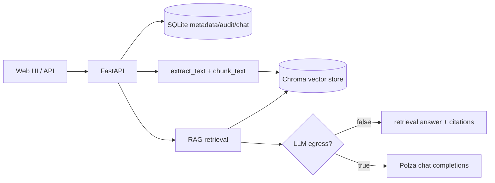

# RAG Knowledge Base

Локальная платформа корпоративных знаний: загружает документы, индексирует их в векторное хранилище, отвечает через RAG-чат и возвращает цитаты из исходных фрагментов. Проект ориентирован на запуск в контролируемом контуре: по умолчанию внешний LLM не вызывается, а секреты живут только в локальных env-файлах.

> Текущий статус: MVP backend + веб-админка. Подробные контракты и история изменений ведутся в [`app/docs`](app/docs/README.md).

## Что уже есть

- Веб-админка на `/`: разделы документов, загрузка файлов, чат, **вкладка «Тесты»** (A/B RAG), история тредов, настройки API/debug.
- REST API на FastAPI: health, разделы, документы, RAG-чат, экспорт ответа, треды чата, **`/v1/rag-test/*`** (профили, прогон, сравнение, overrides основного чата), audit log.
- Ingest документов: `PDF`, `DOCX`, `PPTX`, `XLSX` / `XLSM`, `HTML` / `HTM`, `TXT`, `MD`, `CSV`.
- Хранение: SQLite для метаданных, audit и истории чатов; Chroma для векторного индекса.
- RAG-чат по одному, нескольким или всем разделам с обязательными citations.
- No-egress режим по умолчанию: без внешнего LLM приложение возвращает retrieval-ответ с цитатами.
- Опциональный [PolzaAI](https://polza.ai?referral=VhrEf0gn4S)/OpenAI-compatible LLM через `POLZA_*`, `ALLOW_LLM_EGRESS` и allowlist моделей.
- Опциональный RBAC по ключам: `admin` для ingest/audit/удаления, `member` для чтения и чата.
- Docker Compose запуск и offline-сценарии через локальный кэш wheels/base image.

* ИИ-модели в скрипте используются с сервиса [PolzaAI](https://polza.ai?referral=VhrEf0gn4S), скрипт написан под его API.

## Быстрый старт через Docker

Требования: Docker Desktop / Docker Engine с `docker compose`.

```powershell
.\scripts\ensure-app-env.ps1
docker compose up --build
```

После старта:

- веб-админка: http://127.0.0.1:8002/
- Swagger: http://127.0.0.1:8002/docs
- health: http://127.0.0.1:8002/v1/health

Порт хоста по умолчанию — `8002`, внутри контейнера приложение слушает `8000`. Чтобы сменить порт, скопируй [`env.docker.example`](env.docker.example) в `.env` в корне репозитория и задай `KNOWLEDGE_API_PORT`.

## Локальный запуск без Docker

Требования: Python `>=3.11`.

```powershell
python -m pip install -e .
.\scripts\ensure-app-env.ps1
knowledge-api
```

Альтернатива без entrypoint:

```powershell
uvicorn app.main:app --host 0.0.0.0 --port 8000
```

Если локальная установка упирается в PyPI/proxy/DNS, см. [`app/docs/troubleshooting.md`](app/docs/troubleshooting.md). В репозитории есть вспомогательные скрипты для установки editable-пакета и offline-кэша: [`scripts/pip-install-editable.ps1`](scripts/pip-install-editable.ps1), [`scripts/refresh-local-dist.ps1`](scripts/refresh-local-dist.ps1).

## Конфигурация

Шаблон переменных окружения: [`app/.env.example`](app/.env.example). Для разработки обычно достаточно создать `app/.env` из шаблона и оставить ключи пустыми.

Ключевые группы переменных:

- `APP_DATA_DIR` — каталог SQLite/Chroma.
- `APP_API_KEY`, `APP_ADMIN_KEY`, `APP_MEMBER_KEY` — опциональная аутентификация и роли.
- `POLZA_API_KEY`, `POLZA_BASE_URL`, `POLZA_CHAT_MODEL`, `POLZA_TEMPERATURE` — настройки LLM-провайдера.
- `ALLOW_LLM_EGRESS`, `POLZA_CHAT_MODEL_ALLOWLIST` — контроль внешних вызовов и разрешённых моделей.
- `CHUNK_SIZE`, `CHUNK_OVERLAP`, `MAX_UPLOAD_MB`, `RETRIEVAL_TOP_K` — ingest/RAG лимиты.
- `APP_CORS_ORIGINS`, `APP_PUBLIC_BASE_URL`, `APP_ALLOW_CLIENT_DEBUG` — браузерный UI, CORS и debug.

Не коммить реальные `.env`, ключи и локальные данные. `app/.env`, корневой `.env`, `app/data/` и `local-dist/` исключены из git.

## Команды проверки

```powershell
python -m pytest app/tests/
```

Тесты покрывают health, веб-админку, CORS, базовый flow раздел → документ → чат, RBAC, экспорт, треды чата и fallback citations.

## API и роли

Публичный endpoint:

- `GET /v1/health`

Основные защищённые endpoints:

- `POST /v1/collections`, `GET /v1/collections`, `DELETE /v1/collections/{id}`
- `POST /v1/collections/{id}/documents`, `GET /v1/collections/{id}/documents`, `DELETE /v1/collections/{id}/documents/{document_id}`
- `POST /v1/collections/{id}/chat`
- `POST /v1/collections/{id}/chat/export?format=markdown|plain`
- `/v1/chat/threads/...` для серверной истории чатов
- `GET /v1/audit`

Если ключи не заданы, включён dev-режим без аутентификации. Если заданы `APP_ADMIN_KEY` / `APP_MEMBER_KEY`, передавай ключ через `X-API-Key: <key>` или `Authorization: Bearer <key>`.

## Архитектура



Ключевые файлы:

- [`app/main.py`](app/main.py) — FastAPI app, CORS, `/`, lifespan и запуск.
- [`app/routers/api.py`](app/routers/api.py) — REST API v1.
- [`app/config.py`](app/config.py) — настройки окружения.
- [`app/db_sqlite.py`](app/db_sqlite.py) — метаданные, audit, история чатов.
- [`app/chroma_store.py`](app/chroma_store.py) — Chroma collections и retrieval.
- [`app/ingest.py`](app/ingest.py) — извлечение текста и chunking.
- [`app/chat_service.py`](app/chat_service.py) — RAG-чат и citations.
- [`app/static/index.html`](app/static/index.html) — встроенная веб-админка.

Подробнее: [`app/docs/ARCHITECTURE.md`](app/docs/ARCHITECTURE.md).

## Структура репозитория

```text
app/
  docs/             # каноническая сопутствующая документация
  routers/          # API routers
  static/           # веб-админка
  tests/            # pytest
  *.py              # backend, ingest, RAG, auth, storage
scripts/            # PowerShell-скрипты запуска/установки/offline-кэша
Dockerfile          # основной Docker image
Dockerfile.wheels   # сборка из local-dist/wheels без PyPI
docker-compose.yml  # compose-запуск knowledge-api
pyproject.toml      # зависимости, package metadata, entrypoint knowledge-api
```

## Документация

- [`app/docs/README.md`](app/docs/README.md) — подробный запуск и навигация по документации.
- [`app/docs/ARCHITECTURE.md`](app/docs/ARCHITECTURE.md) — текущее устройство приложения и точки расширения.
- [`app/docs/CHANGELOG.md`](app/docs/CHANGELOG.md) — изменения поведения, API и конфигурации.
- [`app/docs/CONTRIBUTING.md`](app/docs/CONTRIBUTING.md) — правила правок и проверок.
- [`app/docs/ROADMAP.md`](app/docs/ROADMAP.md) — V1/V2/Enterprise ориентиры.
- [`app/docs/troubleshooting.md`](app/docs/troubleshooting.md) — проверенные сценарии диагностики.

## Ограничения MVP

- Это не multi-tenant SaaS и не готовая enterprise HA/DR-инсталляция.
- SSO, расширенный SIEM-audit, видео/ASR, Marp-презентации и полноценные отчёты описаны как будущие направления, но не являются текущим runtime-функционалом.
- Ответы должны опираться на найденные фрагменты. Если релевантного контекста нет, ожидаемый ответ — `НЕ НАЙДЕНО В БАЗЕ`.

