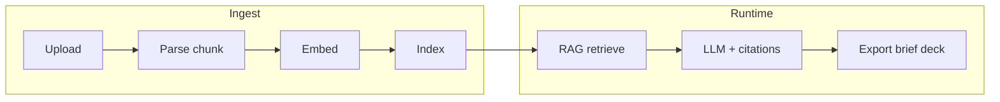

# ARCHITECTURE

## Текущее состояние (репозиторий)

В `app/` реализован MVP backend:

| Компонент | Файлы | Роль |
|-----------|--------|------|
| Конфиг | `app/config.py` | `APP_DATA_DIR`, Polza, размеры чанков и retrieval |
| Метаданные | `app/db_sqlite.py` | Разделы, документы, audit log |
| Векторы | `app/chroma_store.py` | Chroma per-collection, эмбеддинги по умолчанию |
| Ingest | `app/ingest.py` | Извлечение текста (PDF/DOCX/…), chunking |
| Чат | `app/chat_service.py`, `app/llm.py` | RAG → Polza или demo-режим без ключа |
| API | `app/routers/api.py`, `app/main.py` | `GET /` — HTML веб-админка (`app/static/index.html`); `GET /v1/health` публично; остальное под ключом при настройке `APP_*_KEY` |
| RBAC | `app/auth_dep.py` | `admin`: разделы, ingest, audit; `member`: чтение + чат + export |
| Политика LLM | `app/config.py`, проверки в `api.py` / `chat_service.py` | `ALLOW_LLM_EGRESS`, allowlist модели, без egress — retrieval + цитаты без вызова Polza |
| Зависимости контекста | `app/deps.py` | `init_stores` в lifespan: SQLite + Chroma под `data_dir` |

`pyproject.toml` в корне workspace задаёт зависимости и entrypoint `knowledge-api`. Тесты: `app/tests/test_api.py` (обязателен контекстный менеджер `TestClient`, иначе lifespan не вызывается).

## Инварианты

- Секреты только в `app/.env`, файл не коммитится.
- Публичный перечень переменных — только в `app/.env.example`.
- Сопутствующая документация по приложению — в `app/docs/` (см. матрицу в корневых правилах проекта).
- Smoke-тест в `app/tests/` подтверждает подключённый тестовый контур.

## Целевая схема (по мере реализации)

Ниже — ориентир модулей, не обязательство текущего кода.

- **Ingest:** загрузка файлов, извлечение текста, нарезка чанков, метаданные (`doc_id`, страница, версия), векторное (и при необходимости keyword) хранилище.
- **Runtime:** запрос пользователя → retrieval по разделам → генерация ответа с обязательными ссылками на источники → экспорт (текст, позже шаблоны отчётов / Marp).
- **Control plane:** RBAC по разделам, политики моделей (allowlist, no-egress), audit log; в enterprise — SSO, расширенный аудит, backup/HA по `ROADMAP.md`.

## Точки расширения

- Парсинг нестандартных PDF и таблиц — отдельные адаптеры у ingest.
- Видео: очередь задач, ASR в контуре, те же пайплайны chunk/index после расшифровки.
- Интеграции с хранилищами/ECM — после стабильного API разделов.

## Связанные документы

- План по фазам: `ROADMAP.md`
- История изменений: `CHANGELOG.md`
